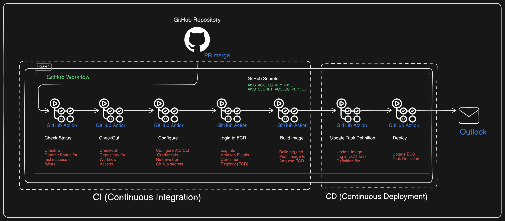

# GitHub Actions CI/CD Pipeline Documentation
# 1. Introduction
This document explains the setup, workflow, and functioning of a CI/CD pipeline using GitHub Actions for deploying containerized applications to AWS ECS (Elastic Container Service).
# The process involves:
  * Continuous Integration (CI): Building, testing, and preparing the application.
  * Continuous Deployment (CD): Pushing Docker images to AWS ECR and updating ECS tasks automatically after a pull request (PR) is merged.
# 2. System Overview
  * Source Code Repository: GitHub
  * CI/CD Engine: GitHub Actions
  * Cloud Provider: Amazon Web Services (AWS)
  * Container Registry: Amazon Elastic Container Registry (ECR)
  * Compute Platform: Amazon Elastic Container Service (ECS)
  * Notification Service: Outlook (for email notifications)

## Flow-of-GitHub-Action

